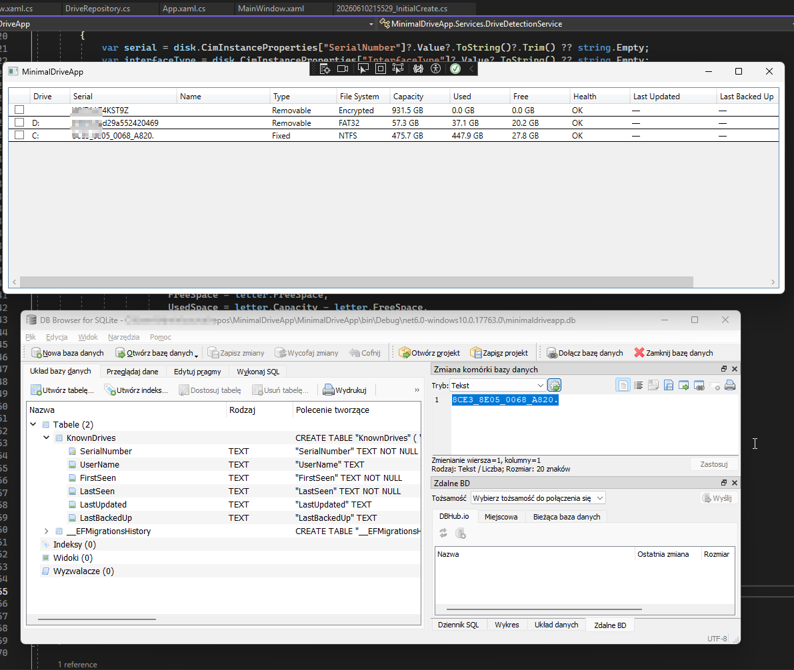
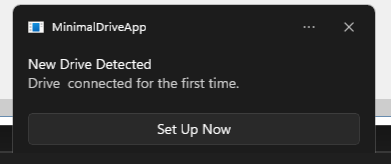
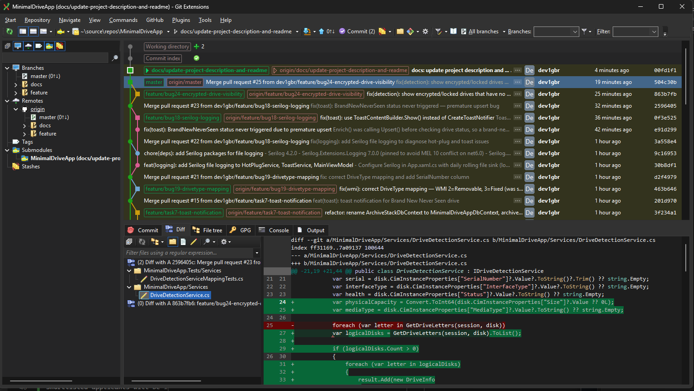
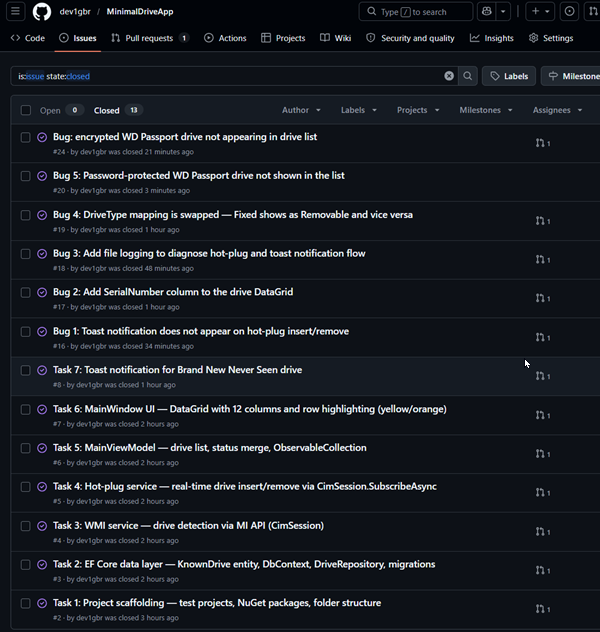
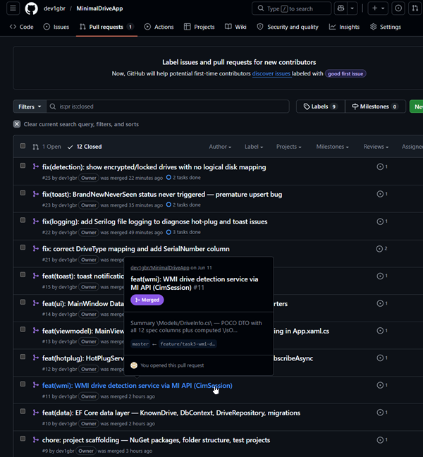

# MinimalDriveApp

A WPF desktop demo application for real-time Windows drive detection and monitoring, built as a Module 1 proof-of-concept.

## Screenshots

### Drive list with SQLite schema


### Hot-plug detection and toast notification


## What it does

- **Drive Dashboard panel** — select a drive in the table to see a live donut chart (used/free), stat tiles, and drive details below the list
- **Automatic drive detection** — scans all connected drives on startup, no manual refresh
- **Real-time hot-plug** — drives appear and disappear automatically within seconds of being connected or removed
- **Encrypted drive support** — hardware-encrypted drives (e.g. WD Passport) show as `Encrypted` even when locked and inaccessible to the OS
- **Drive table** — 13 columns: drive letter, serial number, name, type, file system, capacity, used, free, health, last updated, last backed up, connection type
- **Three drive statuses** — distinguishes Known Named Drives, Previously Seen Unnamed Drives, and Brand New Never Seen Drives using a local SQLite database keyed on hardware serial number
- **Row highlighting** — yellow rows for drives with unbacked changes, orange rows for drives with a health warning
- **New drive alert** — Windows 10/11 toast notification with a "Set Up Now" action when an unknown drive is connected for the first time
- **Structured logging** — Serilog writes a daily rolling log to `logs/app-{date}.log` for diagnosing hot-plug and notification issues

## Technology

| Layer | Technology |
|---|---|
| UI framework | WPF (.NET 8, `net8.0-windows10.0.17763.0`) |
| UI theme | MahApps.Metro 2.4.10 — Dark.Blue |
| Donut chart | LiveChartsCore.SkiaSharpView.WPF 2.1.0-dev-570 — `PieChart` with `PieSeries<double>` |
| MVVM | CommunityToolkit.Mvvm 8.4.0 |
| DI container | Microsoft.Extensions.DependencyInjection 8.0.0 + `Ioc.Default` |
| Drive data | WMI — Microsoft.Management.Infrastructure 3.0.0 (MI API) |
| Persistence | EF Core 8.0.0 + SQLite |
| Notifications | Microsoft.Toolkit.Uwp.Notifications 7.1.3 |
| Logging | Serilog 4.2.0 + Serilog.Sinks.File 6.0.0 |

## NuGet packages

| Package | Version |
|---|---|
| `CommunityToolkit.Mvvm` | 8.4.0 |
| `LiveChartsCore.SkiaSharpView.WPF` | 2.1.0-dev-570 |
| `MahApps.Metro` | 2.4.10 |
| `Microsoft.EntityFrameworkCore.Sqlite` | 8.0.0 |
| `Microsoft.EntityFrameworkCore.Tools` | 8.0.0 |
| `Microsoft.Extensions.DependencyInjection` | 8.0.0 |
| `Microsoft.Management.Infrastructure` | 3.0.0 |
| `Microsoft.Toolkit.Uwp.Notifications` | 7.1.3 |
| `Serilog` | 4.2.0 |
| `Serilog.Extensions.Logging` | 8.0.0 |
| `Serilog.Sinks.File` | 6.0.0 |

## Architecture

```
MinimalDriveApp/
├── Models/          # DriveInfo (WMI DTO), KnownDrive (EF entity), DriveStatus enum
├── Data/            # DbContext, design-time factory, DriveRepository
├── Services/        # DriveDetectionService (WMI), HotPlugService (CIM subscription), ToastService
├── ViewModels/      # MainViewModel, DriveDashboardViewModel
├── Views/           # DriveDashboardView UserControl, Converters
├── Themes/          # Global ResourceDictionary — Colors, Typography, Spacing, Controls, Theme (entry-point)
├── App.xaml.cs      # DI setup, Serilog init, MahApps Dark.Blue theme + Themes/Theme.xaml
├── MainWindow.xaml  # MetroWindow — DataGrid (top) + Dashboard panel (bottom)
└── Migrations/      # EF Core migrations
```

**Data flow:**
```
WMI (MI API)        →  DriveDetectionService  →  DriveInfo (DTO)   ↘
SQLite (EF Core)    →  DriveRepository        →  KnownDrive        →  MainViewModel  →  View
HotPlug (CIM sub.)  →  HotPlugService         →  event              ↗
Serilog             →  ILogger<T> injected into all services and ViewModel
```

## Build & Run

```powershell
# Build
dotnet build MinimalDriveApp.sln

# Run
dotnet run --project MinimalDriveApp\MinimalDriveApp.csproj

# Run all tests
dotnet test MinimalDriveApp.sln
```

Requires Windows 10 or Windows 11. Logs are written to `logs/app-{date}.log` next to the executable.

## Tests

| Project | Type | Count |
|---|---|---|
| `MinimalDriveApp.Tests` | Unit (xUnit + Moq) | 83 |
| `MinimalDriveApp.IntegrationTests` | Integration (xUnit + EF SQLite `:memory:`) | 3 |

## GitHub Flow

The entire project was developed using GitHub Flow: every task starts as a GitHub Issue, gets its own feature branch, and is merged via a reviewed Pull Request. Commit history, branches, and PRs are visible in the repository.

Git Extensions was used as the local Git client throughout development.

### Commit graph (Git Extensions)


### GitHub Issues and Pull Requests
<table>
<tr>
<td></td>
<td></td>
</tr>
</table>
